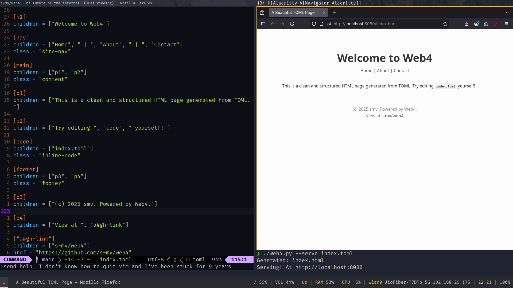

# web4

Transpile TOML into clean HTML... Because that's clearly what
the world needs right now.



## What is web4?

**web4** is a small utility that lets you write HTML using TOML.  
It's a fun and minimal declarative system for generating HTML documents
with structure and attributes defined in simple `.toml` files.

Think of it like a hand-crafted static templating engine—except your
"template" is a TOML config, and the output is HTML5.

---

## Features

* Write HTML in TOML
* Nest tags using `children = [...]`
* Add attributes (`id`, `class`, etc.) as TOML key-value pairs
* Live preview with `--serve` and `--watch`
* Minimal dependencies and zero JavaScript required

---

## Installation

```bash
pip install -r requirements.txt
````

Requires **Python 3.10+**

---

## Usage

```bash
python web4.py FILE.toml [--serve] [--watch]
python web4.py --man  # view manpage-style help
```

### Options

| Flag      | Description                                      |
| --------- | ------------------------------------------------ |
| `--serve` | Launches a local server at `localhost:8080`      |
| `--watch` | Rebuilds the HTML whenever the TOML file changes |
| `--man`   | Displays help in a manpage-like format           |

---

## Syntax

### Required

* A `[root]` section with a `children = [...]`
key defining the root elements.

### Tags

Each TOML section becomes an HTML tag:

```toml
[root]
children = ["html"]

[html]
children = ["head", "body"]

[head]
children = ["title"]

[title]
children = ["Hello, world!"]

[body]
children = ["p"]

[p]
children = ["Welcome to ", "strong", "!"]

[strong]
children = ["web4"]
```

Generates:

```html
<html>
  <head>
    <title>Hello, world!</title>
  </head>
  <body>
    <p>Welcome to <strong>web4</strong>!</p>
  </body>
</html>
```

### Attributes

```toml
["div#main"] # TOML limitations require us to use quotes
class = "container"
children = ["p"]
```

This becomes:

```html
<div id="main" class="container">
  <p>...</p>
</div>
```

### Void Elements

If a section name is a self-closing/void element (like
`img`, `meta`, `br`, etc.), and it has no children, it is
rendered like this:

```toml
[img]
src = "cat.jpg"
alt = "A cute cat"
```

Output:

```html

```

---

## Files

* `*.toml` — Input files
* `*.html` — Output files (same base name)

---

## License

Let's just say that the license is too much for you to handle.
I can't even tell you anything about it. It's because of one of
the clauses in the license.

